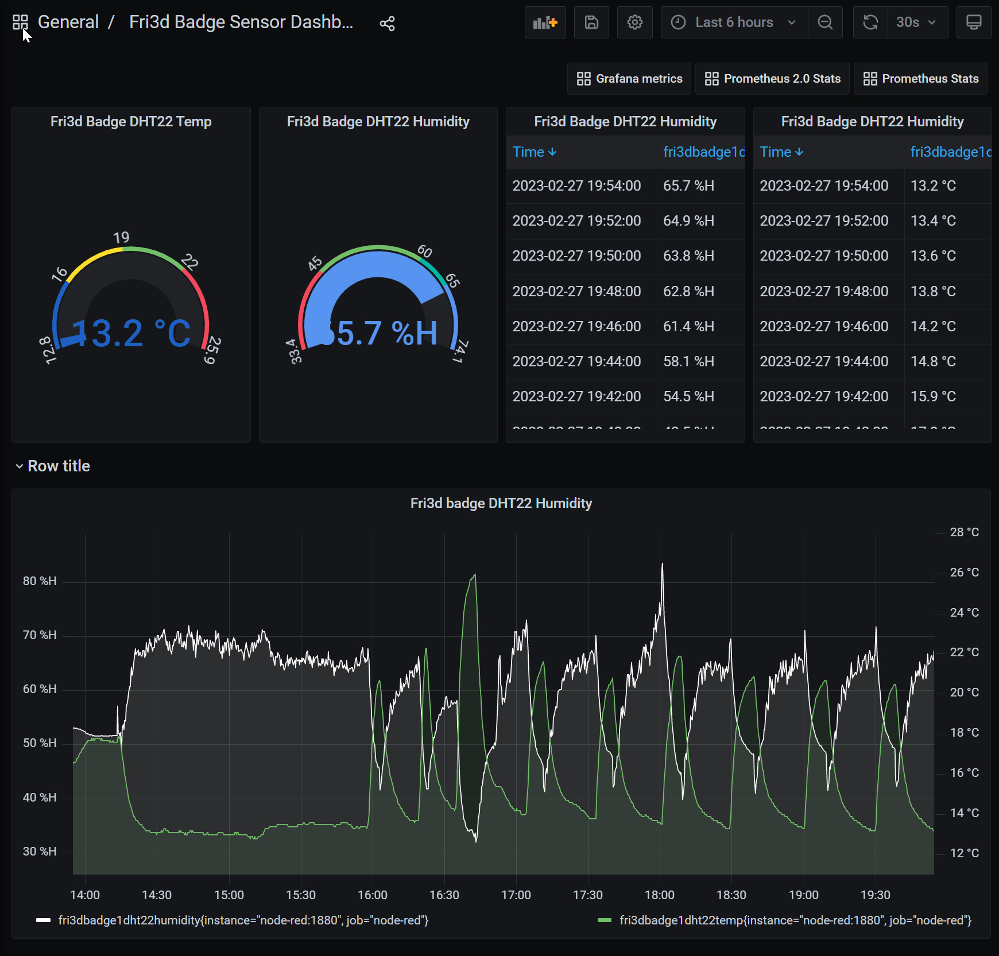
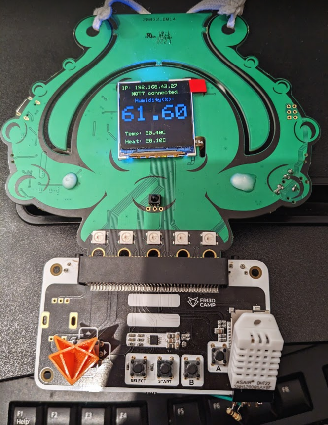
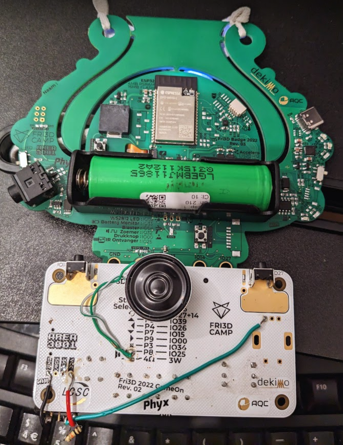

# Weekend Project: Fri3d Badge 2020 + DHT22 Humidity Sensor + Orange Pi 5 => Grafana Dashboard

This repo contains code for a weekend project for using my fri3d badge as an mqtt-connected dht22 sensor that sends data to an orange pi 5 with Orange Pi Os which runs a combination of node red with an mqtt broker and prometheus exporter, prometheus and grafana in docker containers. 
## Result Pictures 

Grafana Dashboard running from Docker containers on Orange Pi 5 |  Badge showing DHT22 readings:
-------------------------:|:-------------------------:
 |  
## Note about Flashing the Fri3d badge
### Bootloader mode needs to be activated
In order to flash the Fri3d badge, you should know that the esp32 first needs to be put into bootloader mode.

What works for me to do this is: 
- I took out the battery
- turned the on-off switch to on (display switch doesn't matter), 
- held the boot button on the badge while plugging in the usb cable in
- then pressed the reset button and release the boot button.

Probably it can be simpler than these steps though, but this works as well.

### Arduino IDE Setup for development and flashing
To get the arduino ide working for this project I had to:
- Add the ESP32 board manager url
- install the ESP boards
- Install Adafruit GFX Library
- Install Adafruit's DHT Sensor Library
- Install Display library: https://github.com/adafruit/Adafruit-ST7735-Library
- Then select ESP32 Dev Module as the board
- Then select the upload port 
- Then flash after putting the device in bootloader mode.

Note that to make this work on linux mint I had to change some group stuff for being able to access the dev/ttyUSB0 as non-root.
Following https://askubuntu.com/questions/133235/how-do-i-allow-non-root-access-to-ttyusb0, I did:
- `sudo usermod -a -G dialout $USER`
- `reboot`
on my linux mint development pc

## TODO
- Make it more efficient to add and extra device or an extra sensor
- Improve documentation regarding node-red config and prometheus config
- Include Node-Red Config in docker image or deployment
- Include Prometheus Config in new docker image or deployment
- Add Wiring diagram
- Clean up Code
- Make project Simulatable in WokWi (de display is an issue here)

### Notes regarding Web Flashing options 
### Conclusion: not really usable for development
- Flashing and arduino development is possible from web with the arduino web editor : https://create.arduino.cc/editor. Notes here:
  - **Has a limit on the amount of times you can compile in the free version**
  - Requires a plugin to be installed
  - In my case, on linux mint, I also needed to install an extra package
  - Board to select is ESP32 Dev Module
  - The web interface runs stuff on the host pc via the plugin, and also allows to load zipped library files in the cloud compilation environment, so we can zip and load the Fri3d Badge 2020 Arduino Library zip. https://github.com/Fri3dCamp/Badge2020_arduino/archive/refs/heads/main.zip library.
- For the Fri3d firmware zip files, you can use https://fri3d-flasher.vercel.app/#/.

## Note about Orange Pi OS
Orange Pi OS looks to be an armbian arm64 fork with some tweaks for adding their UI and some extra software. Notably:
- you can easily install some media server software and a pi hole from the orangepi-config tool.
- Docker and docker-compose is already preinstalled and working well.
- armbian in the commands are renamed with orangepi, so eg `orangepi-config` instead of `armbian-config`, but also `orangepimonitor` instead of `armbianmonitor` etc.

Default username and password there is root: orangepi.
default hostname is orangepi5

## About Orange Pi docker setup.
to start the required docker containers, we need to create a directory for nod red data with correct access rights for docker and then run docker-compose up -d. You can do this by running:
- `./go.sh`

## Hardware: Back of Badge Picture with soldered wires

## Useful related links:
### Fri3d Badge
- https://github.com/Fri3dCamp/badge-2020
  - https://github.com/Fri3dCamp/badge-2020/tree/master/firmware
- https://fri3d-flasher.vercel.app/#/
- https://github.com/Fri3dCamp/Badge2020_arduino
- https://hackaday.io/project/169741-fri3d-2022-badge
- https://docs.espressif.com/projects/esptool/en/latest/esp32/advanced-topics/boot-mode-selection.html
- https://www.esp32.com/viewtopic.php?t=5682#p24710
- https://create.arduino.cc/editor
- https://askubuntu.com/questions/133235/how-do-i-allow-non-root-access-to-ttyusb0

### Node-RED + Plugins + Docker + Prometheus + Grafana
- https://nodered.org/docs/getting-started/docker
- https://flows.nodered.org/node/node-red-contrib-aedes (MQTT Broker for node red)
  - https://github.com/martin-doyle/node-red-contrib-aedes/tree/v0.8.2
- https://flows.nodered.org/node/node-red-contrib-prometheus-exporter
  - https://github.com/Docoyo/node-red-contrib-prometheus-exporter/tree/1.0.5
- https://prometheus.io/
- https://grafana.com/
- https://www.catchpoint.com/blog/node-red-influxdb-grafana (Similar project)

### Orange Pi 5 with Orange Pi OS
- http://www.orangepi.org/html/hardWare/computerAndMicrocontrollers/details/Orange-Pi-5.html
- https://drive.google.com/drive/folders/1YxOLUAunufM6NzAfeEmt5tUnAFOu5bdA (Orange Pi OS drive)
- https://drive.google.com/drive/folders/1Bre2q0bGgXQuQlYaYDMvwstpvtHLmcgX (Orange Pi user manual drive)
- https://www.youtube.com/watch?v=cBqV4QWj0lE (Orange Pi 5 First install guide, not completely followed, we just use sd card)
- https://www.balena.io/etcher
- https://www.sdcard.org/downloads/formatter/ (formatter advised to be used before flashing image on sd card)

## My Node-RED docker image for this:
- https://hub.docker.com/r/francisduvivier/node-red-with-mqtt-and-prometheus

## Web Arduino And ESP32 simulator: project used for trying out text centering code:
- https://wokwi.com/projects/357757982958445569

## DHT22 Temperature and Humidity sensor
- https://lastminuteengineers.com/dht11-dht22-arduino-tutorial/
